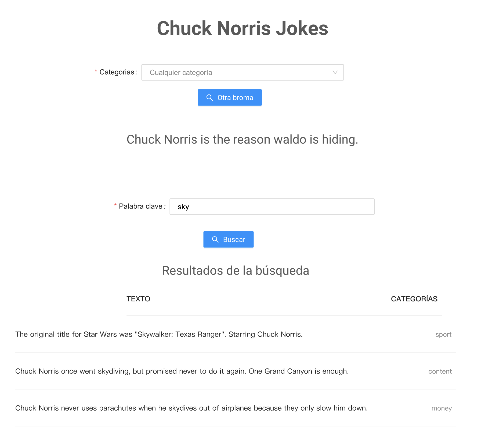

# Examen Bimestre 2

* Escribir una aplicación de React que consuma los datos de la api de Chuck Norris: https://api.chucknorris.io. Esta api tiene 4 endpoints principales:

```
Obtiene una broma aleatoria:
GET https://api.chucknorris.io/jokes/random


Obtiene las categorias disponibles:
GET https://api.chucknorris.io/jokes/categories


Obtiene una broma aleatoria de una categoría específica:
GET https://api.chucknorris.io/jokes/random?category={category}


Permite buscar bromas por palabras clave:
GET https://api.chucknorris.io/jokes/search?query={query}
```

* La aplicación debe hacer lo siguiente:
  1. Al iniciar debe presentar una broma aleatoria de cualquier categoría (https://api.chucknorris.io/jokes/random).
  1. Se debe presentar un botón "Otra broma" que presenta otra broma aleatoria en pantalla.
  1. Se debe contar con un select que presente la lista de categorías disponibles (https://api.chucknorris.io/jokes/categories). El select debe contar con una opción "Cualquier categoría" o el select debe tener la opción de quitar la selección.
  1. Si se presiona el botón "Otra broma" y existe una categoría seleccionada, se debe presentar una broma de la categoría específica (https://api.chucknorris.io/jokes/random?category={category}).
  1. Debajo de esta primera sección debe presentar un campo de texto que permita escribir una palabra clave junto con un botón que permita filtrar las bromas (https://api.chucknorris.io/jokes/search?query={query}). Al presionar el botón, se deben mostar en una lista las bromas que coincidan con la palabra clave.
  
* Puede utilizar la siguiente imagen como referencia de la interfaz:   


